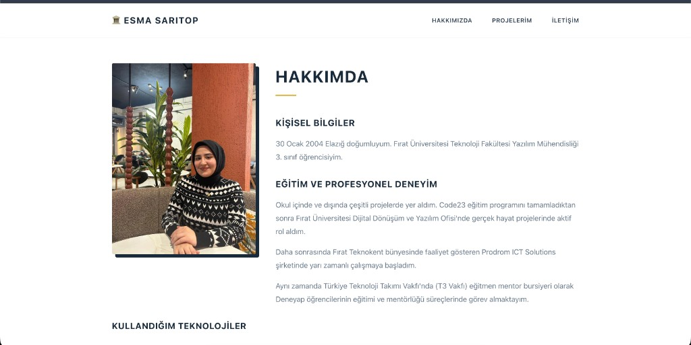
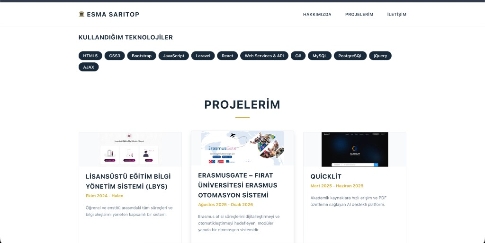
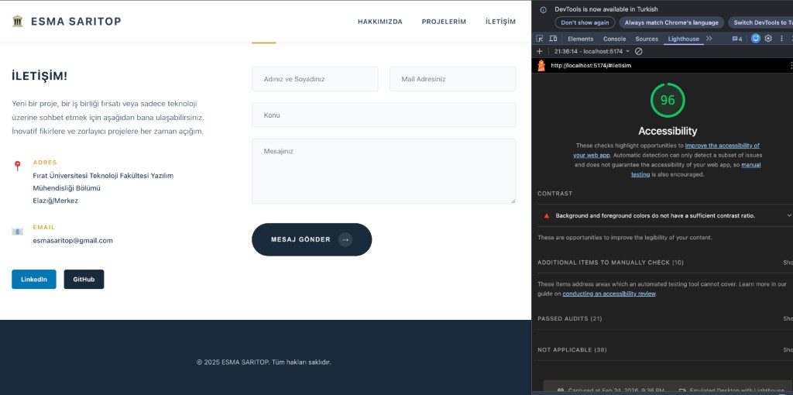

# 📘 Web Programlama Dersi  
## Dönem Boyunca Haftalık Görev Uygulama Projesi

---

## 📌 Proje Hakkında

Bu proje, Web Programlama dersi kapsamında bir dönem boyunca verilecek haftalık görevlerin (tasks) uygulanması amacıyla oluşturulmuştur.

Proje altyapısı modern frontend geliştirme standartlarına uygun olarak **React** ve **Vite** teknolojileri kullanılarak hazırlanmıştır.

Ders süresince her hafta verilen görev, ayrı bir Git branch’i üzerinde geliştirilerek versiyon kontrolü sağlanacaktır. Bu sayede yazılım geliştirme süreci sistematik biçimde takip edilecek ve haftalık ilerleme düzenli olarak kayıt altına alınacaktır.
---
## Gelistirici
**Ad Soyad:** ESMA SARITOP
**Ogrenci No:** 230541100

---

## 🛠 Kullanılan Teknolojiler

- React  
- Vite  
- JavaScript (ES6+)  
- CSS  
- ESLint  

---

## 🌿 Branch Yönetim Stratejisi

Projenin ana dalı: main


Her haftalık görev için ayrı bir branch oluşturulacaktır:
week-1-task
week-2-task
week-3-task
...

### Branch Oluşturma
git checkout -b week-1-task

Görev tamamlandıktan sonra:
git add .
git commit -m "Week 1 task completed"
git push origin week-1-task

Bu yöntem sayesinde:

- Haftalık çalışmalar birbirinden bağımsız tutulur.
- Gelişim süreci geriye dönük incelenebilir.
- Kod yönetimi düzenli ve sürdürülebilir hale gelir.

---

## 🚀 Projenin Çalıştırılması

Projeyi yerel ortamda çalıştırmak için aşağıdaki komutları sırasıyla uygulayın:

```bash
# Bağımlılıkları yükle
npm install

# Projeyi geliştirme modunda çalıştır
npm run dev
```

Uygulama varsayılan olarak şu adreste çalışacaktır: [http://localhost:5173](http://localhost:5173)

---

## 🎯 Projenin Amaçları

Bu proje kapsamında:

- React bileşen yapısının öğrenilmesi  
- State ve Props kavramlarının uygulanması  
- Event yönetimi ve form işlemlerinin geliştirilmesi  
- Routing yapısının kurulması  
- API entegrasyonlarının gerçekleştirilmesi  
- Git branch yönetimi pratiğinin kazanılması  
- Versiyon kontrol disiplininin geliştirilmesi  

amaçlanmaktadır.

---

## 📈 Dönem Sonu Hedefi

Dönem sonunda proje;

- Modüler bir yapıya sahip,  
- Versiyon kontrolü düzenli yürütülmüş,  
- Haftalık gelişimi izlenebilir,  
- Modern frontend geliştirme prensiplerine uygun  

bir uygulama haline getirilmiş olacaktır.

---

## 🖥 Ekran Görüntüleri

| Hakkımda Bölümü | Projelerim Bölümü | İletişim Bölümü |
|---|---|---|
|  |  |  |

---
## Gelistirici
**Ad Soyad:** ESMA SARITOP
**Ogrenci No:** 230541100

---
##LİGHTHOUSETEST


---

